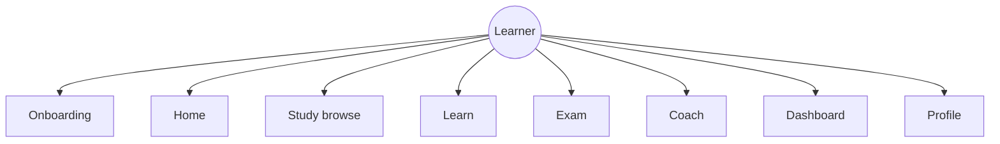
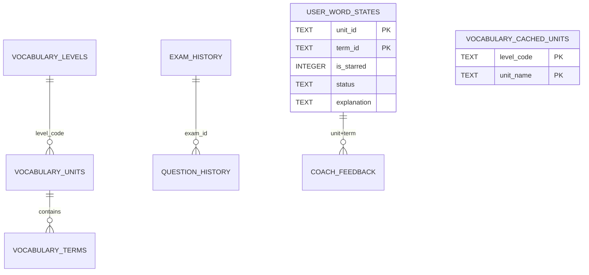
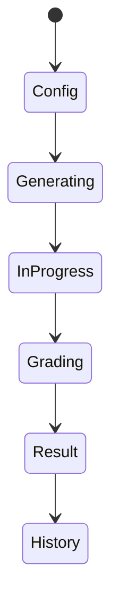
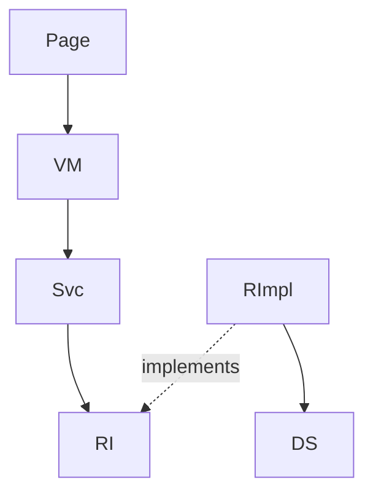

# LEXIA

**Destination Vocabulary Learning App**

Đề tài: Ứng dụng học từ vựng Destination — flashcard, bài kiểm tra & AI Coach  
Tài liệu báo cáo dự án (nộp / trình bày giảng viên)  
**Ngày cập nhật:** 19/07/2026

Flutter · Dart · MVVM theo feature · Provider · GetIt · Dio · SQLite · SharedPreferences · Navigator 2.0 · flutter_tts · REST API

> Brand UI: **Lexia** · Package pub / Android id / DB file: `worduno` (`worduno.db`, schema v6)

---

## Mục lục

1. Giới thiệu project  
2. Mô tả vai trò người dùng  
3. Use case  
4. ERD / Database schema  
5. Business rules  
6. Workflow  
7. Kiến trúc hệ thống  
8. Service design  
9. API endpoint list  
10. Feature access matrix  
11. Local persistence & vocabulary cache demo  
12. AI integration demo  
13. Navigator 2.0 & TTS demo  
14. Hướng dẫn chạy project  
15. Yêu cầu nâng cao đã triển khai  

Phụ lục — Tài liệu liên quan  

---

## 1. Giới thiệu project

### 1.1. Tên đề tài và mục tiêu

Xây dựng **Lexia** — client Flutter học từ vựng *Destination*, thể hiện:

- Kiến trúc **MVVM theo feature** (presentation / application / domain / data)
- SQLite local: trạng thái học, lịch sử exam/coach, **cache từ vựng**
- REST Vocabulary API + AI (Cloze, Sentence Writing, Coach explain/evaluate)
- Navigator 2.0 + 4 tab: Trang chủ · Học tập · Thống kê · Hồ sơ
- `provider` + `get_it`; TTS; onboarding & activity prefs (`shared_preferences`)

### 1.2. Phạm vi hệ thống

| Trong phạm vi (v1) | Ngoài phạm vi |
|--------------------|---------------|
| Onboarding lần đầu | Auth / refresh token |
| Home gateway (streak, daily, continue) | Cloud sync tiến độ |
| Study: Level → Unit → Term + cache | Waitlist / multi-user |
| Learn session | Thanh toán Premium |
| Exam 7 loại + history | Heatmap calendar |
| AI Coach (5/10 từ) + history | Validate payload API |
| Dashboard + Profile hub | Native push |

### 1.3. Công nghệ

| Thành phần | Công nghệ |
|------------|-----------|
| Framework | Flutter (Dart SDK ^3.11.0) |
| State | `provider` + `ChangeNotifier` |
| DI | `get_it` |
| HTTP | `dio` + `connectivity_plus` |
| Local DB | `sqflite` (+ FFI desktop/web) — `worduno.db` v6 |
| Prefs | `shared_preferences` |
| Navigation | Navigator 2.0 |
| Audio | `flutter_tts` |
| Backend | Destination Vocabulary API (Render) |

### 1.4. Cấu trúc thư mục

```
(package: worduno)
├── docs/
├── lib/
│   ├── main.dart
│   ├── app/                 # Shell, DI, routes
│   ├── core/
│   ├── shared/
│   │   ├── vocabulary/      # API + SQLite cache
│   │   └── word_state/
│   └── features/
│       ├── onboarding/
│       ├── home/            # Gateway + Level/Unit/Term (study)
│       ├── learning/
│       ├── exam/
│       ├── coach/
│       ├── dashboard/
│       └── profile/
├── test/
├── pubspec.yaml
└── README.md
```

---

## 2. Mô tả vai trò người dùng

Không phân quyền đa role, không đăng nhập (BR-05).

| Vai trò | Quyền chính |
|---------|-------------|
| **Learner** | Onboarding; Home; Study browse/Learn/Exam/Coach; Dashboard; Profile histories; Star/Know/Learning; TTS |

---

## 3. Use case

### 3.1. Use case theo actor

| Mã | Use case | Mô tả ngắn |
|----|----------|------------|
| UC-L01 | Onboarding | 3 slide; lưu `has_seen_onboarding` |
| UC-L02 | Home gateway | Streak, daily learn, banner, continue last unit |
| UC-L03 | Duyệt Level → Unit → Term | Progress %, reload cache |
| UC-L04 | Search / Sort / Filter | Realtime; Original/A-Z/Z-A; status/star |
| UC-L05 | Term Mode 1 & 2 | List vs flashcard flip |
| UC-L06 | Learn session | Swipe Know/Learning, undo, shuffle |
| UC-L07 | Exam | Config → session → result → history |
| UC-L08 | AI Coach | Explain → write → feedback (5/10 từ) |
| UC-L09 | Dashboard | Aggregate stats |
| UC-L10 | Profile histories | Exam / Coach detail, xóa |
| UC-L11 | TTS | Speak term |

### 3.2. Sơ đồ use case



---

## 4. ERD / Database schema

### 4.1. Entity chính

| Entity | Nguồn |
|--------|-------|
| Level / Unit / Term | API + bảng `vocabulary_*` |
| UserWordState | `user_word_states` |
| ExamHistory / QuestionHistory | SQLite |
| CoachFeedback | `coach_feedback` |

### 4.2. ERD



### 4.3. Schema version 6

| Migration | Thay đổi |
|-----------|----------|
| &lt;2 | `explanation` trên `user_word_states` |
| &lt;4 | Tái tạo `coach_feedback` (bỏ session tables cũ) |
| &lt;5 | `question_history.is_correct` |
| &lt;6 | Tạo `vocabulary_levels/units/terms/cached_units` |

### 4.4. SharedPreferences (ngoài SQLite)

Keys: `has_seen_onboarding`, `streak_count`, `last_active_date`, `daily_learn_*`, `last_unit_*`, `home_banner_dismissed`, `flashcard_default_face`.

---

## 5. Business rules

| # | Quy tắc | Enforcement |
|---|---------|-------------|
| BR-01…03 | Không validate/dedupe API | Client |
| BR-04 | Progress local | SQLite |
| BR-05 | Không login | App |
| BR-06 | State theo `(unit_id, term_id)` | WordState |
| BR-07 | Progress = Know / total | Home/Dashboard |
| BR-08…09 | Learn re-queue / complete khi Know đủ | `LearnSession` |
| BR-10…12 | Search, sort, TTS term-only | utils / TTS |
| BR-13…16 | Exam no timer; AI types; sentence fallback | Exam services |
| BR-17…18 | Coach no numeric score; xóa history | Coach |
| BR-19…20 | Architecture boundaries | Convention |
| BR-21 | Vocab cache-first; Reload = clear/refresh | VocabularyRepository |

---

## 6. Workflow

### 6.1. Word status

`new` ↔ `learning` ↔ `know`; Star độc lập (BR-06).

### 6.2. Learn

Queue → Mark Learning (reappear) / Know (remove) → Undo / Shuffle → Complete khi hết queue.

### 6.3. Exam



### 6.4. Coach

Config (5/10 từ) → per word: Explain → Writing → Evaluating → Feedback → persist `coach_feedback` → Next/Done → Profile history.

### 6.5. App entry

First launch → Onboarding → Home tab. Study browse trên tab Học tập. Histories qua Hồ sơ.

---

## 7. Kiến trúc hệ thống

### 7.1. Tầng



### 7.2. Trách nhiệm

| Tầng | Được | Không được |
|------|------|------------|
| presentation | UI + ViewModel | Dio / SQL |
| application | Use case, grader, generator | Widget |
| domain | Entity, contracts | Flutter UI |
| data | DTO, cache, API | Navigation |

---

## 8. Service design

| Component | Trách nhiệm |
|-----------|-------------|
| `IVocabularyService` / Repository | Fetch + **cache SQLite** |
| `WordStateStore` | Reactive Star/Know/Learning |
| `IHomeService` | Browse + progress counts |
| `ILearnService` | Learn session persist |
| `IExamService` + Generator + Grader | Tạo đề / chấm / history |
| `ICoachService` | Explain, evaluate, history |
| `IDashboardService` | Aggregate stats |
| `ITtsService` | Speak term |
| `ActivityPrefs` (prefs) | Streak, daily, last unit, onboarding |
| `AppNavigationNotifier` | Tabs + study/profile stacks |

---

## 9. API endpoint list

**Base:** `https://destination-vocabulary-api.onrender.com`

### 9.1. Vocabulary

| Method | Route |
|--------|-------|
| GET | `/api` |
| GET | `/api/{level}/units` |
| GET | `/api/{level}/units/{unit_name}` |

### 9.2. Exam AI

| Method | Route |
|--------|-------|
| POST | `/api/exam/cloze` |
| POST | `/api/exam/evaluate-sentence` |

### 9.3. Coach AI

| Method | Route |
|--------|-------|
| POST | `/api/coach/explain` |
| POST | `/api/coach/evaluate` |

Không JWT. Lỗi qua `messageFromDioException`; Sentence Writing có fallback.

---

## 10. Feature access matrix

| Chức năng | Entry |
|-----------|-------|
| Gateway / streak | Tab Trang chủ |
| Level → Term / Learn / Exam / Coach | Tab Học tập |
| Dashboard | Tab Thống kê |
| Exam / Coach history | Tab Hồ sơ |
| Onboarding | Lần đầu mở app |
| Reload vocab | Study Level List |

Isolation v1 = thiết bị + SQLite + prefs (không sync).

---

## 11. Local persistence & vocabulary cache demo

| Demo | Kỳ vọng |
|------|---------|
| Know một từ → kill app → mở lại | Vẫn Know; progress cập nhật |
| Làm exam → Hồ sơ → Detail | Score + câu hỏi còn |
| Coach evaluate → History | `response_json` decode được |
| Mở Unit offline sau khi đã cache | Dữ liệu từ SQLite (cache-first) |
| Reload vocabulary | Làm mới cache từ API |

Tests: `vocabulary_cache_test.dart`, `word_state_persistence_test.dart`.

---

## 12. AI integration demo

| Feature | Endpoint |
|---------|----------|
| Cloze | `POST /api/exam/cloze` |
| Sentence Writing | `POST /api/exam/evaluate-sentence` (pass score ≥ 7) |
| Explain | `POST /api/coach/explain` |
| Evaluate | `POST /api/coach/evaluate` |

---

## 13. Navigator 2.0 & TTS demo

| Mục | Chi tiết |
|-----|----------|
| Delegate / Parser | `AppRouterDelegate`, `AppRouteInformationParser` |
| Tabs | `home`, `study`, `dashboard`, `profile` |
| Study stack | Level → Unit → Term → Learn/Exam/Coach |
| Profile | hub / examHistory / coachHistory |
| Deep links | `/`, `/study`, `/dashboard`, `/profile` |
| TTS | `ITtsService` — chỉ term |

---

## 14. Hướng dẫn chạy project

### 14.1. Môi trường

Flutter SDK ^3.11 · mạng cho API · Android / desktop / web

### 14.2. Chạy

```bash
flutter pub get
flutter run
```

DB: `worduno.db` tạo lần đầu. Không cần tài khoản.

### 14.3. Kiểm tra nhanh

1. Onboarding (nếu lần đầu) → Trang chủ (streak / continue)  
2. Học tập → Level → Unit → Term → Learn  
3. Exam → Result → Hồ sơ → Lịch sử kiểm tra  
4. Coach → Hồ sơ → Lịch sử AI  
5. Thống kê Dashboard  
6. Tắt mạng sau khi đã cache → Unit vẫn mở được  

Checklist: `docs/manual_test_checklist.txt`

---

## 15. Yêu cầu nâng cao đã triển khai

| Mục | Trạng thái |
|-----|------------|
| MVVM + feature boundaries | ✓ |
| DI `get_it` | ✓ |
| Navigator 2.0 + 4-tab IA mới | ✓ |
| SQLite schema v6 + migrations | ✓ |
| Vocabulary cache-first | ✓ |
| WordStateStore reactive | ✓ |
| Exam 7 types + Grader/Generator | ✓ |
| AI Exam + Coach | ✓ |
| Onboarding + ActivityPrefs | ✓ |
| Profile hub | ✓ |
| Connectivity-aware HTTP | ✓ |
| Unit / widget tests | ✓ |
| Cloud sync / Auth | ✗ |
| Đổi hoàn toàn package name → lexia | ✗ (chưa) |

---

## Phụ lục — Tài liệu liên quan

| File | Nội dung |
|------|----------|
| [specs.md](specs.md) | SRS |
| [report.md](report.md) | Báo cáo kỹ thuật ngắn |
| [Lexia_UI_Text_Spec.md](Lexia_UI_Text_Spec.md) | UI text / sitemap |
| [huong_dan_doc_hieu_du_an_mvvm.md](huong_dan_doc_hieu_du_an_mvvm.md) | Đọc code MVVM |
| [test_report.md](test_report.md) | Kết quả test |
| [manual_test_checklist.txt](manual_test_checklist.txt) | Checklist thủ công |
| [../README.md](../README.md) | Quick start |
| API docs | https://destination-vocabulary-api.onrender.com/docs |

---

*Cấu trúc trình bày tham khảo mẫu Campus Event Hub; nội dung kỹ thuật thuộc dự án Flutter Lexia / package worduno.*
