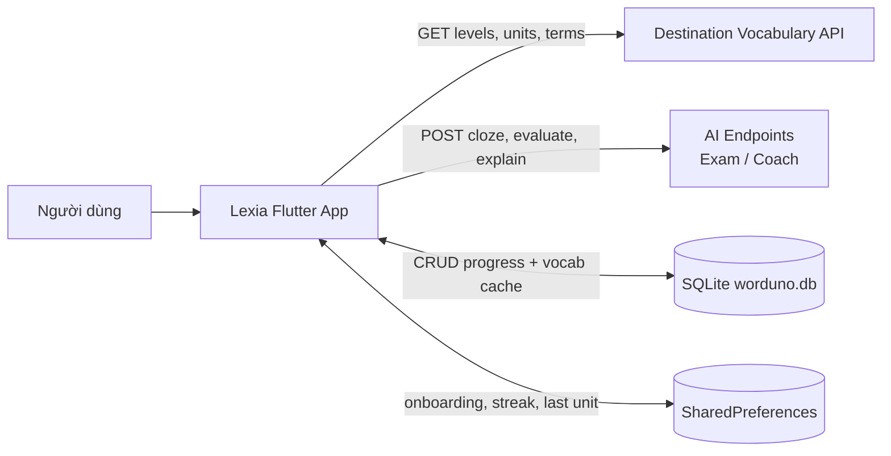
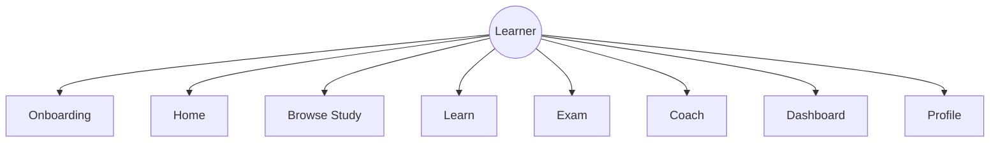
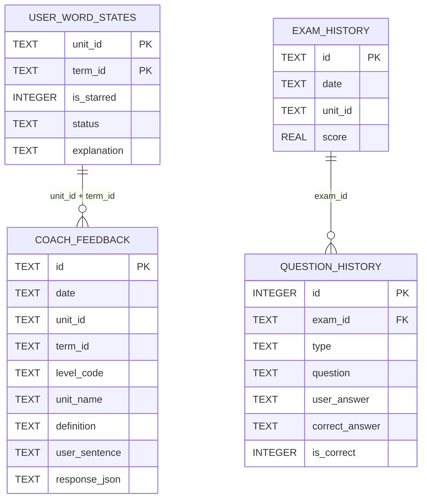
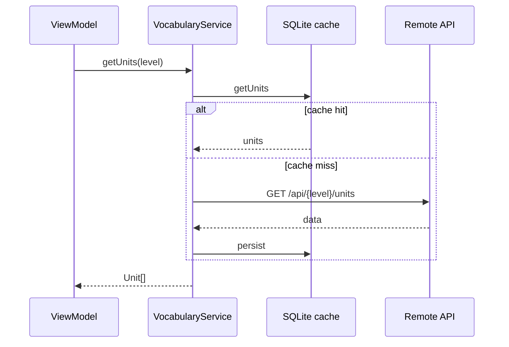

# Báo cáo kỹ thuật — Lexia

**Dự án:** Ứng dụng học từ vựng Destination (Flutter)  
**Brand UI:** Lexia · **Package / DB:** `worduno`  
**Phiên bản:** 1.0.0+1  
**Ngày cập nhật:** 19/07/2026

---

## Mục lục

1. [Tổng quan dự án](#1-tổng-quan-dự-án)
2. [Mục tiêu và phạm vi](#2-mục-tiêu-và-phạm-vi)
3. [Kiến trúc hệ thống](#3-kiến-trúc-hệ-thống)
4. [Công nghệ sử dụng](#4-công-nghệ-sử-dụng)
5. [Use case và chức năng](#5-use-case-và-chức-năng)
6. [Mô hình dữ liệu (ERD)](#6-mô-hình-dữ-liệu-erd)
7. [Tích hợp API](#7-tích-hợp-api)
8. [Luồng dữ liệu](#8-luồng-dữ-liệu)
9. [Điều hướng (Navigation)](#9-điều-hướng-navigation)
10. [Quy tắc nghiệp vụ](#10-quy-tắc-nghiệp-vụ)
11. [Kiểm thử](#11-kiểm-thử)
12. [Tiến độ triển khai](#12-tiến-độ-triển-khai)
13. [Hạn chế và hướng phát triển](#13-hạn-chế-và-hướng-phát-triển)

---

## 1. Tổng quan dự án

**Lexia** là ứng dụng client Flutter hỗ trợ học từ vựng theo bộ sách *Destination*. Từ vựng được lấy từ REST API và **cache local (SQLite)**; trạng thái học, lịch sử exam/coach lưu trên thiết bị. Không yêu cầu đăng nhập.



---

## 2. Mục tiêu và phạm vi

### 2.1 Mục tiêu

| Mục tiêu | Mô tả |
|----------|-------|
| Học từ vựng | Browse + flashcard Learn session |
| Kiểm tra | Exam 7 loại câu hỏi + lịch sử |
| Luyện viết | AI Coach explain + evaluate |
| Theo dõi tiến độ | Home gateway, Dashboard, streak / daily learn |

### 2.2 Phạm vi dữ liệu

Level: **B1 · B2 · C1&C2** → Unit → Term.

### 2.3 Trong / ngoài phạm vi

| Trong phạm vi | Ngoài phạm vi |
|---------------|---------------|
| Onboarding, Profile hub | Cloud sync / multi-device |
| Vocabulary SQLite cache | Auth / tài khoản |
| Streak & daily learn (local prefs) | Heatmap calendar |
| Exam / Coach history qua Hồ sơ | Waitlist / thanh toán |

---

## 3. Kiến trúc hệ thống

### 3.1 MVVM theo feature

```
lib/
├── app/          # Shell, Navigator 2.0, DI
├── core/         # Network, DB, theme, TTS
├── shared/       # vocabulary, word_state
└── features/     # home, learning, exam, coach, dashboard, onboarding, profile
```

| Lớp | Trách nhiệm |
|-----|-------------|
| presentation | Page + ViewModel |
| application | Service / use case |
| domain | Entity + `IRepository` |
| data | DTO, Mapper, DataSource, Repository impl |

### 3.2 Quy tắc

- Page không gọi API trực tiếp; ViewModel không dùng DTO  
- Interface + Implementation cho Service / Repository  
- Không import `data/` của feature khác  
- DI: `get_it` trong `app/di/injection.dart`

---

## 4. Công nghệ sử dụng

| Thành phần | Công nghệ |
|------------|-----------|
| Framework | Flutter (SDK ^3.11.0) |
| State | `provider` + `ChangeNotifier` |
| DI | `get_it` |
| HTTP | `dio` + `connectivity_plus` |
| Local DB | `sqflite` — `worduno.db` **v6** |
| Prefs | `shared_preferences` |
| Navigation | Navigator 2.0 |
| TTS | `flutter_tts` |

---

## 5. Use case và chức năng

| Mã | Use case | Module |
|----|----------|--------|
| UC-01 | Onboarding lần đầu | `onboarding` |
| UC-02 | Home gateway (streak, continue) | `home` |
| UC-03 | Duyệt Level → Unit → Term | `home` + `shared/vocabulary` |
| UC-04 | Learn session | `learning` |
| UC-05 | Exam + Result + History | `exam` |
| UC-06 | AI Coach + History | `coach` |
| UC-07 | Dashboard | `dashboard` |
| UC-08 | Word state Star/Know/Learning | `shared/word_state` |
| UC-09 | Profile hub → histories | `profile` |
| UC-10 | TTS phát âm term | `core/tts` |



---

## 6. Mô hình dữ liệu (ERD)

**File:** `worduno.db` — Schema version **6**

### 6.1 Bảng tiến độ & lịch sử



### 6.2 Vocabulary cache (v6)

| Bảng | PK / ghi chú |
|------|----------------|
| `vocabulary_levels` | `code` |
| `vocabulary_units` | `id`; index theo `level_code` |
| `vocabulary_terms` | `(level_code, unit_name, id)` |
| `vocabulary_cached_units` | `(level_code, unit_name)` — đánh dấu unit đã cache |

Repository: **cache-first** → nếu miss thì gọi API và ghi SQLite; `clearCache()` / Reload vocabulary làm mới.

---

## 7. Tích hợp API

**Base:** `https://destination-vocabulary-api.onrender.com`

| Method | Endpoint | Mục đích |
|--------|----------|----------|
| GET | `/api` | Levels |
| GET | `/api/{level}/units` | Units |
| GET | `/api/{level}/units/{unit_name}` | Terms |
| POST | `/api/exam/cloze` | Cloze AI |
| POST | `/api/exam/evaluate-sentence` | Sentence Writing |
| POST | `/api/coach/explain` | Explain word |
| POST | `/api/coach/evaluate` | Evaluate sentence |

---

## 8. Luồng dữ liệu

### 8.1 Vocabulary cache-first



### 8.2 Exam submit

ViewModel → `ExamService` → `ExamGrader` (+ AI nếu cần) → transaction `exam_history` + `question_history`.

---

## 9. Điều hướng (Navigation)

| Tab UI | Enum | Root |
|--------|------|------|
| Trang chủ | `AppTab.home` | `HomePage` gateway |
| Học tập | `AppTab.study` | Level List → … |
| Thống kê | `AppTab.dashboard` | Dashboard |
| Hồ sơ | `AppTab.profile` | Hub → Exam / Coach history |

Study stack: `Level → Unit → Term → Learn / Exam Config|Session|Result / Coach Config|Session`

Deep links: `/`, `/study`, `/dashboard`, `/profile`.

---

## 10. Quy tắc nghiệp vụ

| ID | Quy tắc |
|----|---------|
| BR-01…03 | Không validate / dedupe dữ liệu API |
| BR-04 | Trạng thái học local |
| BR-05 | Không đăng nhập |
| BR-06 | Star / Know / Learning theo Unit |
| BR-07 | Progress = Know / tổng |
| BR-08…09 | Learn re-queue Learning; kết thúc khi mọi term Know |
| BR-10…12 | Search, sort, TTS chỉ đọc term |
| BR-13…16 | Exam không timer; AI cloze/sentence; fallback sentence |
| BR-17…18 | Coach không điểm số; cho phép xóa history |
| BR-19…20 | MVVM boundaries |

---

## 11. Kiểm thử

| Nhóm | Ví dụ |
|------|--------|
| Word state | `word_state_persistence_test`, `word_state_store_test` |
| Vocabulary cache | `vocabulary_cache_test.dart` |
| Learn / Exam / Coach | session, grader, flow, widget pages |
| Navigation | `navigation_notifier_test`, `route_parser_test` |
| Network errors | `dio_error_message_test` |

```bash
flutter test
```

Chi tiết: [test_report.md](test_report.md), [manual_test_checklist.txt](manual_test_checklist.txt).

---

## 12. Tiến độ triển khai

| Module | Trạng thái |
|--------|------------|
| app / core / shared | ✅ |
| onboarding, home gateway, study browse | ✅ |
| learning, exam, coach, dashboard, profile | ✅ |
| Vocabulary SQLite cache (v6) | ✅ |
| Streak / daily learn / last unit prefs | ✅ |

---

## 13. Hạn chế và hướng phát triển

| Hạn chế | Ghi chú |
|---------|---------|
| Dual naming | UI Lexia; package/DB/`WordunoApp` vẫn Worduno |
| Không sync cloud | Đổi máy mất tiến độ |
| AI phụ thuộc backend | Cloze / evaluate cần mạng + quota |
| iOS display name | Vẫn placeholder Flutter mặc định |

Hướng phát triển: hoàn tất rebrand package/DB; sync đám mây; i18n; harden widget tests.

---

## Tài liệu liên quan

| File | Nội dung |
|------|----------|
| [Lexia_Project_Report.md](Lexia_Project_Report.md) | Báo cáo tổng thể trình bày |
| [specs.md](specs.md) | SRS |
| [Lexia_UI_Text_Spec.md](Lexia_UI_Text_Spec.md) | UI / sitemap |
| [../README.md](../README.md) | Quick start |
